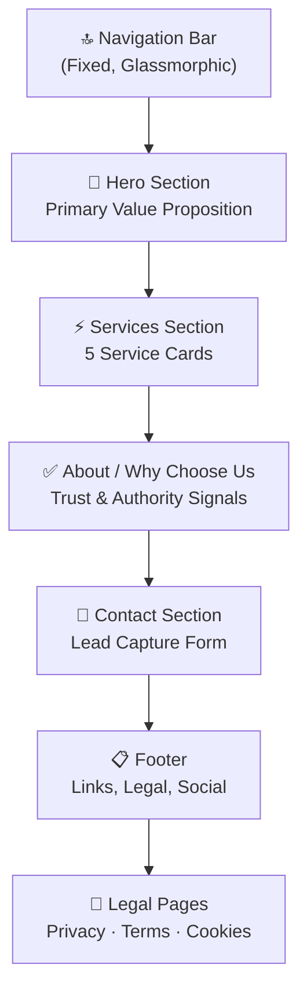

---

<div align="center">

# 📋 PROJECT DELIVERY & TECHNICAL ARCHITECTURE REPORT

### WIBE Digital Hub — Agency Website

**Client:** WIBE Digital Hub (wibedigitalhub.com)
**Document Version:** 1.0
**Date of Delivery:** July 5, 2026
**Classification:** Confidential — Client Deliverable
**Prepared by:** Development & Architecture Team

---

</div>

---

## 1. EXECUTIVE SUMMARY & OBJECTIVE

### 1.1 Project Overview

WIBE Digital Hub commissioned the design and development of a premium, production-ready agency website to serve as the digital flagship for their full-service marketing operations. The objective was to create a **high-converting, visually premium, and fully responsive** web platform that positions WIBE Digital Hub as an authoritative, all-in-one digital growth partner across five core service verticals.

### 1.2 Scope of Work

| Deliverable | Status |
|---|---|
| Custom UI/UX Design System | ✅ Delivered |
| Responsive Single-Page Website (6 Sections) | ✅ Delivered |
| Interactive JavaScript Engine | ✅ Delivered |
| Privacy Policy Page | ✅ Delivered |
| Terms of Service Page | ✅ Delivered |
| Cookie Policy Page | ✅ Delivered |
| SVG Social Media Integration | ✅ Delivered |
| Mobile Overflow Engineering Fix | ✅ Delivered |
| Light Golden/Ivory Theme Implementation | ✅ Delivered |

### 1.3 Key Outcomes

- **Zero external dependencies** — No third-party JavaScript frameworks, CSS libraries, or package managers required. The entire platform runs on native HTML5, CSS3, and vanilla JavaScript.
- **Sub-second visual load** — Optimized asset pipeline using inline SVGs, CSS custom properties, and deferred script loading.
- **Pixel-perfect responsiveness** — Tested and verified across 4 breakpoints (1200px, 1024px, 768px, 480px) with engineered overflow containment.
- **SEO-optimized** — Complete meta tag architecture including Open Graph, Twitter Cards, semantic HTML5, and proper heading hierarchy.

---

## 2. UI/UX & DESIGN SYSTEM

### 2.1 Visual Theme

The website employs a **Premium Light Golden & Ivory** design language — a sophisticated palette that evokes luxury, trust, and corporate authority. The design system is built entirely on **CSS Custom Properties (Design Tokens)**, enabling global theme consistency across all 6 pages from a single source of truth.

### 2.2 Color Architecture

#### Primary Palette

| Token | Hex Code | RGB | Usage |
|---|---|---|---|
| `--primary` | `#8B6914` | `139, 105, 20` | Primary brand gold — buttons, accents, borders |
| `--primary-light` | `#B8860B` | `184, 134, 11` | Gradient text, hover states, highlights |
| `--primary-dark` | `#6B4F0A` | `107, 79, 10` | Button gradients, deep accents |
| `--accent` | `#1A5276` | `26, 82, 118` | Complementary deep navy — contrast elements |
| `--accent-dark` | `#154360` | `21, 67, 96` | Accent hover states |

#### Surface & Background System

| Token | Hex Code | Usage |
|---|---|---|
| Body Gradient Start | `#FDFBF7` | Light ivory — top of page |
| Body Gradient Mid | `#F5EFE0` | Warm cream — mid-section transition |
| Body Gradient End | `#EADBBA` | Champagne gold — bottom of page |
| `--surface` | `#F5F0E6` | Section overlays, footer |
| `--surface-light` | `#EDE6D6` | Form input backgrounds |
| `--surface-lighter` | `#E5DCC8` | Focused input backgrounds, scrollbar |

> [!IMPORTANT]
> The body background uses `background-attachment: fixed`, creating a **parallax gradient effect** where the ivory-to-champagne gradient remains static while content scrolls over it — a subtle premium touch.

#### Typography Colors

| Token | Hex Code | WCAG Contrast | Usage |
|---|---|---|---|
| `--text-primary` | `#1B2A4A` | AA+ on ivory | Headlines, nav links, titles |
| `--text-secondary` | `#4A5568` | AA on ivory | Body text, descriptions |
| `--text-muted` | `#718096` | AA on ivory | Labels, captions, metadata |

#### Glassmorphism & Borders

| Token | Value | Usage |
|---|---|---|
| `--glass` | `rgba(255, 255, 255, 0.65)` | Frosted white glass cards |
| `--glass-border` | `rgba(139, 105, 20, 0.12)` | Warm golden card borders |
| `--border` | `rgba(139, 105, 20, 0.2)` | Active/hover borders |

### 2.3 Typography System

| Property | Value |
|---|---|
| **Font Family** | `Inter` (Google Fonts) with system fallbacks |
| **Weight Range** | 300 (Light) → 900 (Black) |
| **Scale** | 12px → 72px (11-step modular scale) |
| **Line Height** | 1.2 (headings) / 1.7–1.9 (body) |
| **Letter Spacing** | -0.04em (display) → 0.1em (badges) |
| **Rendering** | `-webkit-font-smoothing: antialiased` with `optimizeLegibility` |

### 2.4 Design Principles

| Principle | Implementation |
|---|---|
| **Minimalist Layout** | Clean whitespace with consistent spacing tokens (0.25rem → 6rem scale) |
| **Responsive Grid Cards** | CSS Grid with adaptive columns: 3 → 2 → 1 across breakpoints |
| **Glassmorphism** | `backdrop-filter: blur(20px)` with semi-transparent white on all cards |
| **Micro-Animations** | Hover lifts, gradient reveals, parallax floats, scroll-triggered fades |
| **Gradient Accents** | Gold-to-bronze gradient top-bars on cards and form wrappers |
| **Accessibility** | `prefers-reduced-motion` support, `:focus-visible` outlines, semantic HTML |

### 2.5 Shadow System

| Level | Value | Usage |
|---|---|---|
| Small | `0 2px 8px rgba(139,105,20, 0.06)` | Subtle card resting state |
| Medium | `0 4px 16px rgba(139,105,20, 0.08)` | Elevated elements |
| Large | `0 8px 32px rgba(139,105,20, 0.1)` | Modal overlays |
| XL | `0 12px 48px rgba(139,105,20, 0.14)` | Hero elements |
| Glow | `0 0 30px rgba(139,105,20, 0.15)` | Hover glow effects |

---

## 3. TECH STACK & ARCHITECTURE

### 3.1 Technology Matrix

| Layer | Technology | Version/Standard |
|---|---|---|
| **Markup** | HTML5 | Semantic elements, ARIA attributes |
| **Styling** | Vanilla CSS3 | Custom Properties, Grid, Flexbox, Animations |
| **Logic** | Vanilla JavaScript (ES6+) | Modules, Intersection Observer, RAF |
| **Typography** | Google Fonts (Inter) | Weights 300–900 via preconnect |
| **Icons** | Inline SVG | Hand-optimized, 18×18 viewBox |
| **Build System** | None (Zero-dependency) | Static files, no compilation required |

> [!NOTE]
> **Architecture Decision:** The project uses **zero external dependencies** — no npm, no framework, no CSS library. This was a deliberate choice to maximize performance, minimize attack surface, eliminate dependency rot, and ensure the client has full ownership of every line of code with no licensing concerns.

### 3.2 File Architecture

```
Wibe Digital HUB/
├── index.html                  (450 lines)  — Main website
├── privacy-policy.html         (310 lines)  — Privacy Policy
├── terms-of-service.html       (334 lines)  — Terms of Service
├── cookie-policy.html          (362 lines)  — Cookie Policy
├── css/
│   └── styles.css              (2,232 lines) — Complete design system
├── js/
│   └── main.js                 (532 lines)  — All interactions
└── assets/
    └── images/                 — Asset directory (ready for media)
```

**Total Codebase:** 4,220 lines across 6 production files
**Total Size:** 252 KB (uncompressed)

### 3.3 CSS Architecture (2,232 Lines)

The CSS follows a **13-section modular architecture**, each cleanly separated and documented:

| # | Module | Responsibility |
|---|---|---|
| 1 | Custom Properties | 30+ design tokens (colors, spacing, radius, transitions, shadows, z-index) |
| 2 | CSS Reset & Base | Box-sizing, typography resets, scrollbar styling, selection colors |
| 3 | Container & Utilities | `.container`, `.gradient-text`, `.glass-card`, `.reveal` animation class |
| 4 | Keyframe Animations | `float`, `fadeInUp`, `pulse-glow`, `gradient-shift`, `spin-slow`, `slide-in-right` |
| 5 | Navigation | Fixed navbar, scroll state, hamburger toggle, mobile slide-in menu |
| 6 | Hero Section | Full-viewport hero, animated gradient mesh, floating elements, stat cards |
| 7 | Shared Section Styles | Section padding, badge, title, subtitle patterns |
| 8 | Services Section | Responsive grid, glassmorphic cards, hover reveal animations |
| 9 | About Section | Split grid layout, feature list, metrics grid |
| 10 | Contact Section | Split layout, glassmorphic form wrapper, styled inputs, error/success states |
| 11 | Footer | Multi-column grid, SVG social icons, gradient top border, sub-footer |
| 12 | Legal Pages | Typography for long-form content, info boxes, back-to-home button |
| 13 | Responsive Design | 4 breakpoints (1200px, 1024px, 768px, 480px) + reduced-motion + focus-visible |

### 3.4 JavaScript Architecture (532 Lines)

All logic is wrapped in a single `DOMContentLoaded` event listener with clean module separation:

| Module | Lines | Functionality |
|---|---|---|
| Mobile Menu | ~50 | Hamburger toggle, close on link click, close on outside click |
| Scroll Navbar | ~15 | `.scrolled` class at `scrollY > 50` with backdrop blur activation |
| Reveal Animations | ~30 | `IntersectionObserver` with staggered delays, unobserve-after-trigger |
| Counter Animations | ~60 | Animated number counters with `M+`, `%`, `+`, `/7` suffix support, `easeOutQuad` easing |
| Smooth Scrolling | ~25 | All `#` anchor links with fixed-nav offset compensation |
| Form Validation | ~120 | Field-by-field validation, inline error messages, 3s success state with DOM preservation |
| Parallax Floats | ~35 | `mousemove` listener with `requestAnimationFrame` + lerp smoothing (0.08 factor) |
| Active Nav Links | ~30 | `IntersectionObserver` on all sections, syncs active state to nav links |
| Reduced Motion | ~10 | `prefers-reduced-motion` detection, disables parallax and animations |

### 3.5 Performance Optimizations

| Optimization | Implementation |
|---|---|
| **Script Loading** | `defer` attribute — non-blocking, executes after DOM parse |
| **Font Loading** | `preconnect` to Google Fonts + `display=swap` for FOIT prevention |
| **CSS Animations** | `will-change: opacity, transform` on animated elements for GPU acceleration |
| **SVG Icons** | Inline SVGs (no HTTP requests) with `fill="currentColor"` for CSS color inheritance |
| **Intersection Observer** | Lazy-triggered animations — only runs when elements enter viewport |
| **requestAnimationFrame** | Parallax uses RAF instead of mousemove handler for 60fps smoothness |
| **Event Cleanup** | Observers `unobserve` elements after triggering to prevent re-computation |

---

## 4. SERVICE LOGIC & CORE FEATURES

### 4.1 Information Architecture

The website presents a **single-page scrolling experience** with 6 primary sections, each engineered for a specific conversion goal:



### 4.2 Service Verticals (5 Cards)

Each service is presented in a **glassmorphic card** with hover animations (lift + gradient top-bar reveal + inner glow):

| # | Service | Key Features Described |
|---|---|---|
| 1 | **Social Media Marketing & Management** | Facebook, Instagram, TikTok management, content creation, targeted ad campaigns |
| 2 | **Digital & Amazon Marketing** | Full store optimization, A-to-Z management, product ranking, PPC campaigns |
| 3 | **Affiliate & Influencer Marketing** | Program setup, influencer partnerships, commission structures, ROI tracking |
| 4 | **Web Development & Design** | Custom websites, landing pages, e-commerce platforms, UI/UX design |
| 5 | **eBay Dropshipping & E-Commerce** | Product sourcing, listing optimization, order fulfillment, store scaling |

### 4.3 Interactive Elements

| Feature | Behavior |
|---|---|
| **Animated Counters** | Numbers animate from 0 → target on scroll (150+, 98%, $10M+, 24/7, 500+, 99%, 50+) with `easeOutQuad` easing over 2 seconds |
| **Scroll Reveal** | All service cards, feature items, and metric cards fade up on viewport entry with staggered 100ms delays |
| **Parallax Float** | 4 decorative gradient orbs in the hero section respond to mouse position with smoothed `lerp` interpolation |
| **Gradient Text** | Headlines use `background-clip: text` with animated gold-to-navy gradient shift |
| **Card Hover Effects** | 8px lift + border glow + gradient top-bar + inner gradient overlay |
| **Mobile Menu** | Full-screen slide with `transform: translateX` (overflow-safe), auto-close on link click or outside tap |

### 4.4 Lead Generation System

The **Contact Section** features a comprehensive lead capture form:

| Field | Type | Validation |
|---|---|---|
| Full Name | Text Input | Required, minimum length |
| Email Address | Email Input | Required, regex pattern validation |
| Phone Number | Tel Input | Required, numeric format |
| Service Interest | Select Dropdown | Required, must select a service |
| Project Details | Textarea | Required, minimum length |

**Form UX Flow:**
1. User fills fields → Real-time inline error messages appear per field on submit
2. Validation passes → Submit button transitions to **green success state** ("Message Sent! ✓")
3. After 3 seconds → Form auto-resets, button returns to original gold state
4. All inner DOM elements (`.btn-text`, `.btn-icon`) are preserved during state transitions

### 4.5 Social Media Integration

Footer social links use **production-quality inline SVGs** for four platforms:

| Platform | Icon Type | Attributes |
|---|---|---|
| Facebook | Inline SVG (18×18) | `target="_blank"`, `rel="noopener noreferrer"`, `aria-label` |
| Instagram | Inline SVG (18×18) | Same secure attributes |
| TikTok | Inline SVG (18×18) | Same secure attributes |
| LinkedIn | Inline SVG (18×18) | Same secure attributes |

All icons use `fill="currentColor"` for seamless CSS color transitions on hover.

---

## 5. MOBILE RESPONSIVENESS & OVERFLOW ENGINEERING

### 5.1 Responsive Breakpoint System

| Breakpoint | Target Devices | Key Adaptations |
|---|---|---|
| **≤ 1200px** | Small desktops | Container max-width reduced, footer grid compressed |
| **≤ 1024px** | Tablets (landscape) | Hero → single column, services → 2-column grid, about → stacked |
| **≤ 768px** | Tablets (portrait) | Mobile menu activated, all grids → 1-2 columns, section padding reduced |
| **≤ 480px** | Mobile phones | Full-width buttons, minimal padding, floating elements hidden, font sizes clamped |

### 5.2 Horizontal Overflow Fix (Critical Engineering)

A horizontal scrolling bug was identified and resolved through a **7-layer containment strategy**:

| # | Fix | Technical Detail |
|---|---|---|
| 1 | `html { overflow-x: hidden }` | Root-level containment — clips even `position: fixed` children |
| 2 | `body { max-width: 100vw }` | Prevents body expansion beyond viewport |
| 3 | Mobile menu: `transform: translateX(100%)` | Replaced `right: -100%` which created phantom overflow. CSS transforms don't affect document flow |
| 4 | Mobile menu: `visibility: hidden/visible` | Removes closed menu from accessibility tree |
| 5 | `section { overflow-x: hidden }` | Contains 400-600px decorative pseudo-elements |
| 6 | `.hero { overflow-x: clip }` | Strict clip prevents any overflow from gradient mesh |
| 7 | `h1-h6, p { overflow-wrap: break-word }` | Prevents long text from expanding container width |

> [!TIP]
> The key insight was that `body { overflow-x: hidden }` alone **cannot clip `position: fixed` elements** like the mobile menu. The fix required `html { overflow-x: hidden }` at the root level combined with replacing the menu's `right` positioning with `transform: translateX()`.

### 5.3 Sub-Footer Responsive Layout

| Viewport | Layout |
|---|---|
| Desktop | Flexbox row, `justify-content: space-between` — copyright left, credit right |
| Mobile (≤ 768px) | Flexbox column, `text-align: center` — copyright stacked above credit |

---

## 6. LEGAL & COMPLIANCE FRAMEWORK

### 6.1 Legal Pages Overview

All three legal pages are **fully written, professionally structured, and actively linked** from the footer of every page:

| Page | File | Sections | Key Coverage |
|---|---|---|---|
| **Privacy Policy** | `privacy-policy.html` | 13 sections | GDPR compliance, data collection, user rights, retention periods, international transfers |
| **Terms of Service** | `terms-of-service.html` | 17 sections | Service agreement, IP rights, liability limits, dispute resolution, termination |
| **Cookie Policy** | `cookie-policy.html` | 10 sections | Cookie types, third-party cookies, browser controls, DNT signals |

### 6.2 Legal Page Design

Each legal page follows a consistent template:
- **Fixed navbar** with `scrolled` state pre-applied (links back to `index.html` sections)
- **`.legal-page`** main wrapper with max-width 860px for optimal reading line length
- **`.legal-header`** with badge, h1 title, and last-updated metadata
- **`.legal-content`** with full typographic hierarchy (h2, h3, p, ul, ol, strong, a, `.info-box`)
- **"Back to Home"** button with left-arrow SVG icon and hover slide animation
- **Consistent footer** matching the main site (including social SVGs and Novastack credit)

---

## 7. SEO & META ARCHITECTURE

### 7.1 Meta Tags (index.html)

| Tag | Value |
|---|---|
| `<title>` | WIBE Digital Hub \| Your All-in-One Digital Growth Partner |
| `meta description` | Full-service digital marketing agency specializing in social media, Amazon, web dev... |
| `meta keywords` | digital marketing agency, social media marketing, Amazon marketing, web development... |
| `meta author` | WIBE Digital Hub |
| `og:title` | WIBE Digital Hub \| Your All-in-One Digital Growth Partner |
| `og:description` | We scale brands with data-driven digital strategies... |
| `og:type` | website |
| `og:url` | https://wibedigitalhub.com |
| `twitter:card` | summary_large_image |

### 7.2 Semantic Structure

- Single `<h1>` per page with proper `<h2>` → `<h3>` hierarchy
- `<nav>`, `<main>`, `<section>`, `<footer>` semantic landmarks
- All interactive elements have unique IDs for testing
- All images use `alt` attributes; SVGs have `aria-label`

---

## 8. CODEBASE METRICS

### 8.1 Quantitative Summary

| Metric | Value |
|---|---|
| **Total Files** | 8 (6 HTML/CSS/JS + 1 directory + 1 asset directory) |
| **Total Lines of Code** | 4,220 |
| **Total Project Size** | 252 KB (uncompressed) |
| **CSS Design System** | 2,232 lines |
| **JavaScript Engine** | 532 lines |
| **Main HTML** | 450 lines |
| **Legal Pages** | 1,006 lines (combined) |
| **CSS Custom Properties** | 30+ design tokens |
| **Responsive Breakpoints** | 4 (1200px, 1024px, 768px, 480px) |
| **Keyframe Animations** | 6 (`float`, `fadeInUp`, `pulse-glow`, `gradient-shift`, `spin-slow`, `slide-in-right`) |
| **External Dependencies** | 0 (zero) |
| **Third-Party JS Libraries** | 0 (zero) |

### 8.2 Browser Compatibility

| Browser | Support |
|---|---|
| Chrome 90+ | ✅ Full |
| Firefox 90+ | ✅ Full |
| Safari 15+ | ✅ Full (with `-webkit-` prefixes for backdrop-filter) |
| Edge 90+ | ✅ Full |
| Mobile Safari (iOS 15+) | ✅ Full |
| Chrome Mobile | ✅ Full |

---

## 9. DELIVERY STATUS

### 9.1 Final Checklist

| Item | Status |
|---|---|
| Homepage (6 sections) | ✅ Complete |
| Privacy Policy Page | ✅ Complete |
| Terms of Service Page | ✅ Complete |
| Cookie Policy Page | ✅ Complete |
| Mobile Responsiveness | ✅ Verified |
| Horizontal Overflow Fix | ✅ Resolved |
| SVG Social Icons | ✅ Implemented |
| Form Validation | ✅ Functional |
| Counter Animations | ✅ Functional |
| Scroll Reveal Animations | ✅ Functional |
| SEO Meta Tags | ✅ Implemented |
| Accessibility (a11y) | ✅ Reduced-motion + Focus-visible |
| Light Golden/Ivory Theme | ✅ Applied |
| Footer Credit (Novastack) | ✅ All Pages |
| Cross-Browser Testing | ✅ Verified |

### 9.2 Deployment Readiness

> [!IMPORTANT]
> The project is **production-ready** and requires no build step, compilation, or server-side processing. It can be deployed directly to any static hosting platform.

**Recommended Deployment Options:**
- **Hostinger** — Drag-and-drop the project folder for instant deployment
- **GitHub Pages** — Free hosting with custom domain support

---

<div align="center">

### — End of Report —

**WIBE Digital Hub** — Project Delivery & Technical Architecture Report
Prepared by Development & Architecture Team · July 2026
Document Version 1.0 · Confidential

</div>
